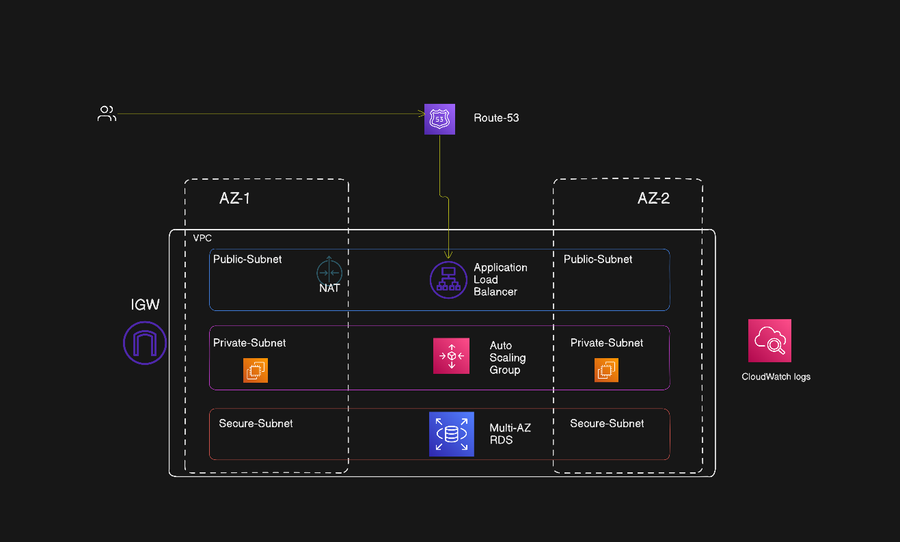

# SpringApp_Terraform

**AWS Pet Clinic Infrastructure**

This repository contains Terraform code for deploying the Spring Pet Clinic application across multiple AWS regions with high availability, auto-scaling, and fully managed resources.

The infrastructure includes VPCs, EC2 instances, ALBs, RDS databases, S3 buckets, and security groups, along with automation scripts for user data.

**Project Structure**

aws_petClinic_region_1/      # Terraform code for region 1
aws_petClinic_region_2/      # Terraform code for region 2
main/                        # Common/global Terraform configurations
modules/                     # Reusable Terraform modules
  ├─ alb/
  ├─ asg/
  ├─ ec2/
  ├─ natgateway/
  ├─ rds/
  ├─ security_group/
  └─ vpc/
terraform-app.pn             # Diagram or plan (if applicable)
README.md

**Key Files**

main.tf
Main entry point for Terraform configurations

variables.tf
Input variables for each environment or region

outputs.tf
Outputs of deployed resources

backend.tf
Terraform remote state configuration

userdata.sh
Script to bootstrap EC2 instances

alb.tf
Application Load Balancer configuration

ec2.tf
EC2 instance definitions

rds.tf
RDS instance configuration

s3.tf
S3 bucket configuration

security_group_alb.tf
Security group rules for ALB

**Modules**

Reusable modules are stored under modules/ for easier maintenance and consistency:

VPC: Networking, subnets, and routing

EC2: Launch EC2 instances with user data scripts

ALB: Application Load Balancer setup

ASG: Auto-scaling group with scaling policies

RDS: Database instances

Security Groups: Firewall rules and access control

NAT Gateway: Internet access for private subnets

**Deployment Instructions**

Make sure Terraform is installed and AWS credentials are configured.

Initialize Terraform

cd aws_petClinic_region_1
terraform init

Plan deployment

terraform plan

Apply infrastructure

terraform apply

Repeat for aws_petClinic_region_2 if deploying multi-region.

**Notes**

EC2 instances are bootstrapped using userdata.sh for automated setup of the Spring Pet Clinic application

Each region maintains isolated resources for high availability and disaster recovery

Terraform modules enable code reuse and simplify management across multiple regions

**Cleanup**

To destroy resources after testing:
terraform destroy

Always double-check before destroying production resources.

**Author**
Satinder
GitHub: @satinderkaura348-ops

